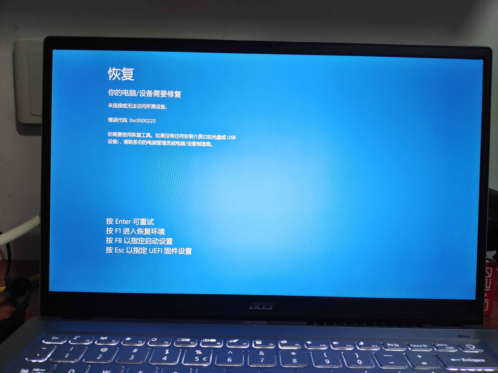
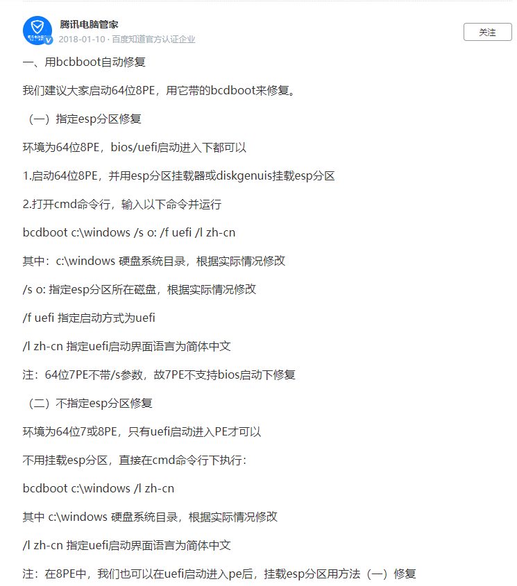
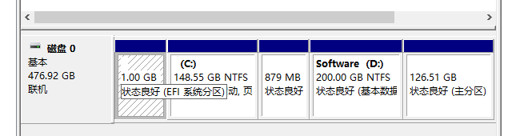

# arch安装过程中遇到的问题

20220905
安装的全过程是看的知乎大佬的图文教程：[2021 Archlinux双系统安装教程（超详细） - 知乎 (zhihu.com)](https://zhuanlan.zhihu.com/p/138951848)
安装工作是很久之前完成的，这篇文章是安装后补写的，因此安装前的各种信息没办法截图记录。

## 安装前

### 修改efi分区

我原本的efi分区之后默认的100MiB，但是arch Linux官网上建议大小是300MiB，知乎教程上也建议扩大分区，于是我就安装了DiskGenius打算从C盘分店容量给efi，
> 当时执行到这一步的时候我想起来了，电脑刚买回来的时候efi分区和C盘之间应该是有一个“恢复分区”，但我当时不知道那个是干什么的，于是上网找方法把它给删掉了，之后多出来的空间加到C盘去了。
> 如果我当时没动这个恢复分区的话，现在就可以把恢复分区加到efi分区了，就不用动C盘了，也就没有之后这么多麻烦了。

当时DiskGenius提示无法直接在系统里把C盘向后移动，要用PE系统。
于是我找到了B站大佬自制的PE：[下载 – HotPE](https://www.hotpe.top/download)
把PE安装在了SD卡上，进PE，用其自带的DiskGenius将C盘向后移动了一段距离，并把这些距离分到了efi分区中，此时efi分区容量刚好是1GiB。

### 恢复系统

退出PE，进入原系统，然后就出现问题了：

显示错误码0xc0000225。上网搜了这个错误码，看了几篇方法：
[Windows 10出现0xc0000225错误代码如何解决？_都叫兽软件 (reneelab.com.cn)](https://www.reneelab.com.cn/m/windows-10-0xc0000225-error.html)

[解决Win10开机0xc0000225进不去系统的5个方法！ (abackup.com)](https://www.abackup.com/easybackup-tutorials/win10-boot-0xc0000225-cannot-enter-6540.html)
试了其中几篇不需要系统启动盘的方法，无效。
之后我又在PE中把efi分区和C盘恢复，退出PE，再次进入原系统，这个时候仍然是蓝屏，不过错误码变成了0xc000000f。同样，也查了这个错误码：[快速修复：出现错误代码0xc000000f怎么解决？ (disktool.cn)](https://www.disktool.cn/content-center/your-pc-needs-to-be-repaired-0xc000000f-666.html)

又这样反复了几次后，感觉这些方法都没什么用，于是打算重装系统。当然，在重装前进PE把C盘中的部分文件保存到了D盘中。

### 重装系统

这个主要也是看的知乎文章，不过现在找不到那篇文章了。
主要步骤就是制作启动盘和装系统。

#### 制作系统盘

先下载系统镜像文件。我在著名的[msdn, I tell you](https://msdn.itellyou.cn)上下的Windows10镜像，启动盘制作工具用的[Rufus](https://rufus.ie/zh/)。
由于原系统用不了，就直接用的PE就行制作。
但总是进度条没过多久就报错，我一开始还以为是U盘的问题（毕竟这个U盘是高二买的，之后大量读写后已经明显损坏了），还向刘舟禹借了他的U盘，结果还是同样的问题。
反复试了很多次，还上网查了报错码，换了Rufus的好几个版本，还是没用。
一天中午的时候，我想试试家里的Windows7老电脑，结果一试，居然成了！还是用的有无数坏道的老U盘。那么看来应该就是PE无法制作启动盘了。

#### 装系统

在装系统前，试了下之前文章中用启动盘恢复系统的方法，还是无效，这才真正开始装系统了。
直接装，还是没办法装上去，这个时候我心态已经平和了，于是直接扔下不管了。

#### 关联efi分区和C盘

过了几天，心情稳定下来后，再接着想办法解决问题。
根据鸟哥的Linux教程给出的开机流程，我猜测原efi分区是直接用硬盘扇区地址联系到C盘的，而我移动了C盘，efi内记录的仍是原C盘的位置，开机时引导到错误的C盘位置，所以就蓝屏。
如果我能重置efi分区，让它联系到新的C盘，这样应该就能够正确开机。
上网搜了重置efi分区的方法：[如何重新建立EFI引导分区_百度知道 (baidu.com)](https://zhidao.baidu.com/question/653113488423102885/answer/2864708912.html)
查到了百度知道上腾讯电脑管家官方的回答：

跟着这个方法，在PE中cmd用命令：

~~~cmd
bcdboot c:\windows /s o: /f uefi /l zh-cn
~~~

> 这个命令是直接抄的回答，当时的盘符现在记不得了。
> 当时根据回答改了盘符。

之后退出PE，重进系统，错误码从0xc0000225变成了0xc000000f，我肯定是看不懂具体什么意思，当时单纯以为成功联系efi分区和C盘了，特别激动，然后赶快再次装系统，这次进入的界面都和之前不一样了。

#### 再次装系统

重装系统其实就是格式化原系统盘，然后装上新的系统。
在格式化系统盘时，又出问题了，连一个分区都识别不到。
再次上网查了：
[疑难解答 - 如何解决安装Windows 11/10时找不到磁盘驱动器 | 官方支持 | ASUS 中国](https://www.asus.com.cn/support/FAQ/1044458#A2)
总之就是英特尔第十一代酷睿加了新特性，导致了找不到磁盘驱动器。
我用的时宏碁电脑，结果在华硕官网上找到了答案。
根据答案在启动盘上下了相关工具，在装系统时用上工具，成功识别到磁盘。
之后的步骤就很简单了。
安装完后又安装各种Windows更新，装各种驱动……最后勉强回到之前系统的状态（不过肯定还是有蛮多不一样的，比如电池策略就只有一个，原来还有一个Acer策略；系统还带了个“移动套餐"的UWP应用，原来是没有的；新系统安装不了英特尔傲腾软件，第一次成功安装了，但是启用不了，之后连安装都安装不上……其他地方应该也有些不同，但我可能感觉不到）

### 结果

本来打算安装arch Linux的，结果先学会了安装Windows。
不过结果还是OK的，efi分区已经扩大到了1GiB：

> C、D盘间还多了个恢复分区

------

## 安装时

安装时倒是没出什么太大的问题，直接跟着知乎流程走就OK了。

------

## 安装后

安装后主要有几个问题：没有预装的浏览器，没有中文输入法，连电脑自带的扬声器也用不了，用不了蓝牙。

### 浏览器

原来有个KDE自带的浏览器，不过明显不太好用，之后我自己用命令行装了Firefox，勉强用了一下，还是用不习惯。最后跟着网上的教程装了edge，具体哪篇文章找不到了。
> 即使是Linux的edge也可以登录微软账号同步消息，edge确实特别好用。

### 中文输入法

看的知乎其他的文章，装了fcitx5。
一开始还用不了汉语输入，后面才发现添加的是“键盘-汉语”，只有添加“Pinyin”或其他比如“Wubi”这样的输入法才能输入汉语。
添加汉语输入法后又发现英语输入法又出问题了：它会显示完整单词（单词补全），即使是在命令行里也会显示，但Windows中，即使是安装输入法前的arch Linux输入英文时也没有这个单词补全：

我不希望输英文也有这个补全功能。但无论我怎么改设置，都去不掉这个英文补全。
之后突然一次重启后，英文补全就没了，我到现在也不知道是什么原因。

### 电脑自带的扬声器

一开始用不了扬声器，看视频没有声音，插有线耳机也没用。
觉得是声卡的驱动没打上，先是找了很多文章装驱动，但也没有效果。用`aplay -l`命令也是显示找不到声卡。
最后看到这篇arch Linux社区上的提问：[SOLVED No Sound card found in fresh Arch installation / Newbie Corner / Arch Linux Forums](https://bbs.archlinux.org/viewtopic.php?id=258594)
装上sof-firmware和alsa-ucm-conf这两个藏得特别深的固件后重启，才成功启用扬声器。

### 蓝牙

直接看的官网上的[Bluetooth (简体中文) - ArchWiki (archlinux.org)](https://wiki.archlinux.org/title/Bluetooth_(%E7%AE%80%E4%BD%93%E4%B8%AD%E6%96%87))
可以连上我的罗技K380，但还是连不上我的联想蓝牙耳机，看了csdn上的文章[(18条消息) Failed to connect: org.bluez.Error.Failed_没有B树的博客-CSDN博客](https://blog.csdn.net/qq_34548075/article/details/107062005)后还是没用。其实即使是连K380还是不太顺利。
这个蓝牙问题到现在还没解决。
