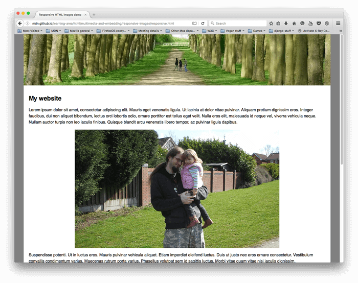
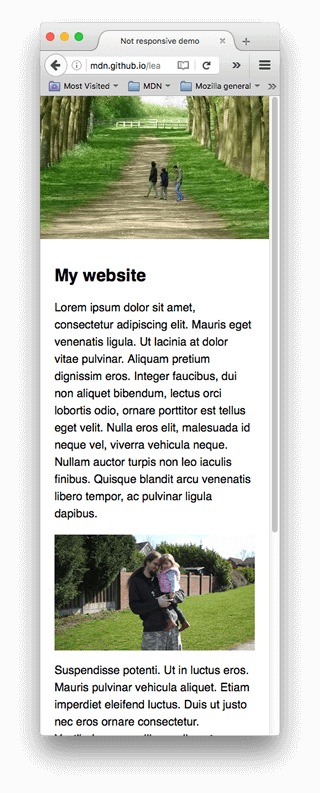

# 前端——响应式图片

## 场景

同一个网站，在宽屏设备（以电脑端）的情况：

在窄屏设备（以手机为例）的情况：

网站原生就是为宽屏设备设计，宽屏设备的情况就是网站开发人员想要表现的界面。
到了窄屏设备，主要变化就是页眉的图片变窄了，页眉图片和内容图片所占屏幕的比例变了——页眉图片所占的比例更大了，内容图片更小了。
> 占屏幕的比例（简称占屏比）
> 这里所说的占屏比不是单靠数字计算，即算显示物体总像素数再去出屏幕总像素书，从而得到一个比值。
> 更关键的是给人的观感：
>
> 1. 高度height越小而宽度width越大，占屏比越小。也就是说，越偏向窄条型的东西占屏比越小，越偏向正方形的东西占屏比越大
> 2. 位置越靠近中心的东西占屏比越大，越靠近边缘的东西占屏比越小。

总而言之，在手机上，页眉图片占比更大了，内容图片更小了，但由于人们往往更关注内容图片（页眉图片一般是CSS背景图片，起装饰作用），这样就破坏了人们的阅读体验。

这时作为网站开发/设计人员，就应该想办法降低页眉占屏比，而提高内容图片占屏比。

------

## 图片尺寸、分辨率、像素

关于这几个内容网上各种说法，质量也参差不齐，我一直都没有形成固定概念，这次就固定下来了。

### 尺寸

这里的尺寸以**厘米**为单位，也就是说，图片的尺寸指的是真实世界中的大小。
不是以像素为单位！！！

### 分辨率

分辨率ppi，Pixel Per Inch，即每英寸像素数，定义了真实世界中图像的精细程度：600ppi的图像像素更密集，也就是说，将同一幅图像在真实世界中分别以600ppi和300ppi的分辨率打印出来，在近距离观看的情况下，600ppi的图像比300ppi的图像更精细。

### 像素

就是图像的像素点数量，有两种表示方法，第一种4比3比例的4800万像素，第二种6000乘8000，这两种方法表示的完全是一种东西。

关键公式：`尺寸 *分辨率 = 像素`
这个公式连接了图片在真实世界中的显示和在计算机中的显示。
公式左边表示将图片打印下来，尺寸越大，代表必须降低分辨率，这就意味着近距离看图片将会十分粗糙，但却适合远距离看；同样，如果为了使图片更精细，提高分辨率，必然要缩小图片的尺寸，这时图片就更小了，只能近距离看了。
在计算机中只考虑像素（高度像素* 宽度像素），因为毕竟计算机的显示就是以像素为单位的。
但是，计算机确实只管像素这一个属性的，可我们人眼是看显示屏的啊，又不能直接看存在计算机里的二进制数据。因此，显示屏就代替了打印机，负责连接计算机和真实世界了。

### 显示器参数

显示器公式：`显示尺寸 *显示分辨率 = 像素`
和打印出来一样，显示尺寸也就是图片显示在显示器上的真实大小，我们直接用尺子去量显示器上的图片，量到多长，显示尺寸就是多长。显然，是以厘米为单位。
> 其实显示尺寸就是尺寸，由于大家基本都是用屏幕看图片，因此特意拿出来说，意味：*显示器中图片的尺寸属性*

显示分辨率也一样就是分辨率，即单位长度上的像素数，表示像素密度，图片精细程度。
我们在屏幕上看图时，如果将图片缩放调成100%，也就是图片像素和显示器像素点对点，显示分辨率就是屏幕的分辨率。

------

回到原问题来，我们想降低页眉图片的占屏比，根据公式`显示尺寸 * 显示分辨率 = 像素`，我们实际希望降低的显示尺寸，在显示分辨率不变的情况下（比如浏览器控制缩放100%，即控制显示分辨率为屏幕的分辨率），可以降低像素，也就是说，在窄屏设备上使用页眉图片像素更少的版本，就会使得显示尺寸更小，从而降低了占屏比。
为了降低像素，一个方法是对图片进行裁切，保留重要部分，删去次要部分。同时，也可以减少图片高度heigh，这样也能降低占屏比。这样通过裁切的方式我们把它称为**美术设计问题（art direction problem）**。
由于页眉图片更小了，内容图片就更靠近中间位置了，从而也提高了内容图片的占屏比。
